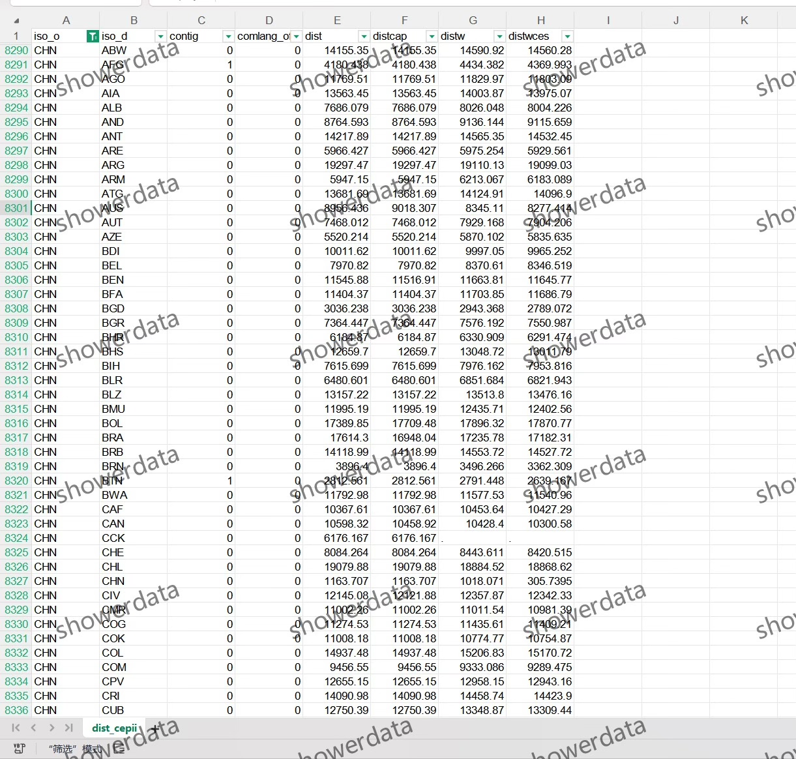

## Body

Worldwide Geographic Distances (CEPII Download)

1. Data Introduction
(1) Data Details: See the image below for details. Please read it carefully before purchasing! The complete description is provided, so make sure to confirm if this is what you need before placing your order! No returns or exchanges will be accepted for any reason after shipment!
(2) Data Name: Worldwide Geographic Distances (CEPII Download)
(3) Sample Range: 224 countries or regions
(4) Result Data Format: Excel
(5) Data Content: Results and Word explanations

## Images

item_1007340810118

Here is a pay link on Stripe ( https://buy.stripe.com/3cs8yP7sY87d0vu9AB ). Please contact me lonlonago@foxmail.com after funding $89, and I will send you a complete data files , thank you!

